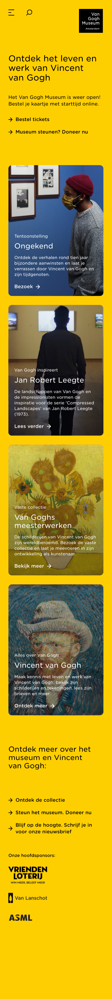

# Procesverslag
Markdown is een simpele manier om HTML te schrijven.  
Markdown cheat cheet: [Hulp bij het schrijven van Markdown](https://github.com/adam-p/markdown-here/wiki/Markdown-Cheatsheet).

Nb. De standaardstructuur en de spartaanse opmaak van de README.md zijn helemaal prima. Het gaat om de inhoud van je procesverslag. Besteedt de tijd voor pracht en praal aan je website.

Nb. Door *open* toe te voegen aan een *details* element kun je deze standaard open zetten. Fijn om dat steeds voor de relevante stuk(ken) te doen.

## Jij

uitwerken voor kick-off werkgroep

### Auteur:
Michelle Akkermans 

#### Je startniveau:
Blauw

#### Je focus:
Surface plane
 

## Je website

uitwerken voor kick-off werkgroep

### Je opdracht:
https://www.vangoghmuseum.nl/en
 
#### Screenshot(s) van de eerste pagina (small screen): 
hier de naam van de pagina  

#### Screenshot(s) van de tweede pagina (small screen):
hier de naam van de pagina  

 

## Breakdownschets (week 1)

uitwerken na afloop 2e werkgroep

### de hele pagina: 

### dynamisch deel (bijv menu): 

### wellicht nog een dynamisch deel (bijv filter): 

 
  
  

## Voortgang 1 (week 2)

uitwerken voor 1e voortgang

### Stand van zaken
Het opzetten van de basic html ging best prima, natuurlijk was het even inkomen maar dan nog ging het best vlot. 

### Verslag van meeting
hier na afloop snel de uitkomsten van de meeting vastleggen

- Mijn HTML was erg netjes
- Ik had nog niet verder veel css of javascript, maar wat ik had was een goed en net begin. 

## Voortgang 2 (week 3)

uitwerken voor 2e voortgang

### Stand van zaken
Zeker het schrijven van de css was iets wat mij echt wel wat tijd en moeite kostte aangezien ik vrijwel alles en beetje vergeten was. Ook had ik wel moeite met dat sommige delen van de site ingewikkelder waren, waardoor ik ook zeker veel vastgelopen heb. Gelukkig hebben mijn medestudenten mij hier ook mee kunnen helpen. 

### Verslag van meeting
hier na afloop snel de uitkomsten van de meeting vastleggen

- Alles zag er nog een beetje simpeltjes uit.
- Ik moest nog op zoek naar een font dat iets meer leek op die van de site zelf. 
- Begin optijd aan de 2e pagina.

## Toegankelijkheidstest (week 4)

Helaas kon ik in verband met werk niet in de les zijn bij de toegankelijkheidstest. Dit had ik besproken met de leraar en die zei dat het niet erg was als ik de les miste. 

## Voortgang 3 (week 4)

uitwerken voor 3e voortgang

### Stand van zaken
Ik heb wel veel gestruggled met de surface plane elementen werkend erin te krijgen. Na veel slag en stoot heb ik dan ook maar een paar werkende gekregen. 

### Verslag van meeting
hier na afloop snel de uitkomsten van de meeting vastleggen

- Ik heb hulp gehad met een probleem met mijn position sticky
- Ik was de alt text van de images vergeten. 
- De student assistent heeft mij gewezen op een onnodig div element, want ik dus weg heb kunnen werken. 

## Eindgesprek (week 5)

uitwerken voor eindgesprek

### Stand van zaken
hier dit ging goed & dit was lastig (neem ook screenshots op van delen van je website en code)

### Screenshot(s)

hier screenshot(s) van je eindresultaat

## Bronnenlijst

continu bijhouden terwijl je werkt

Nb. Wees specifiek ('css-tricks' als bron is bijv. niet specifiek genoeg).

1. bron 1
2. bron 2
3. ...

